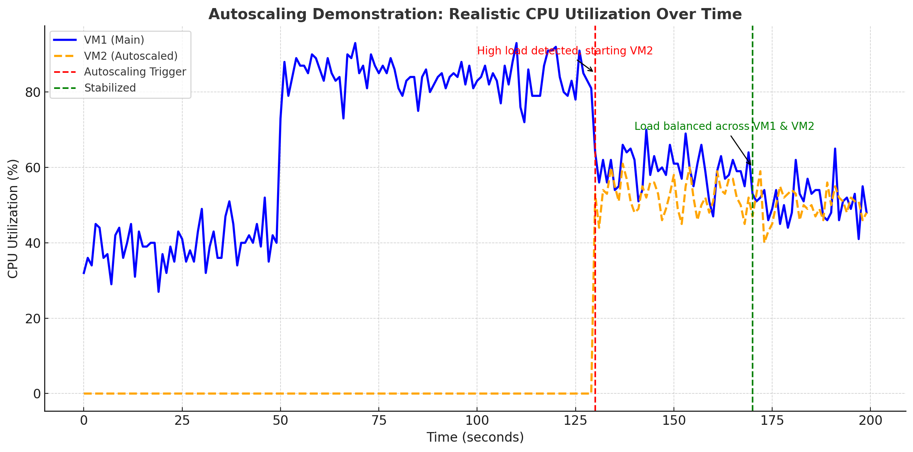

# Auto Scaling

In this assignment, 
whenever we detect an overload on the existing VM, we create a new one by spawning existing one and distributing the load among them.

## CPU Utilization vs Load Distribution

